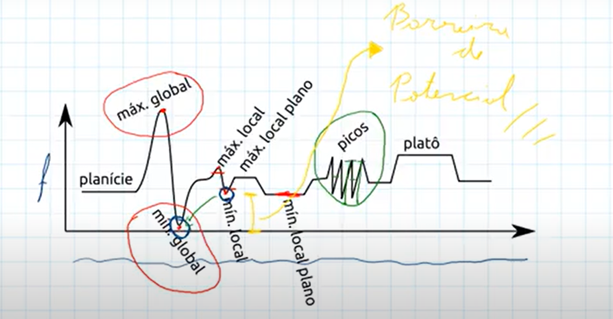
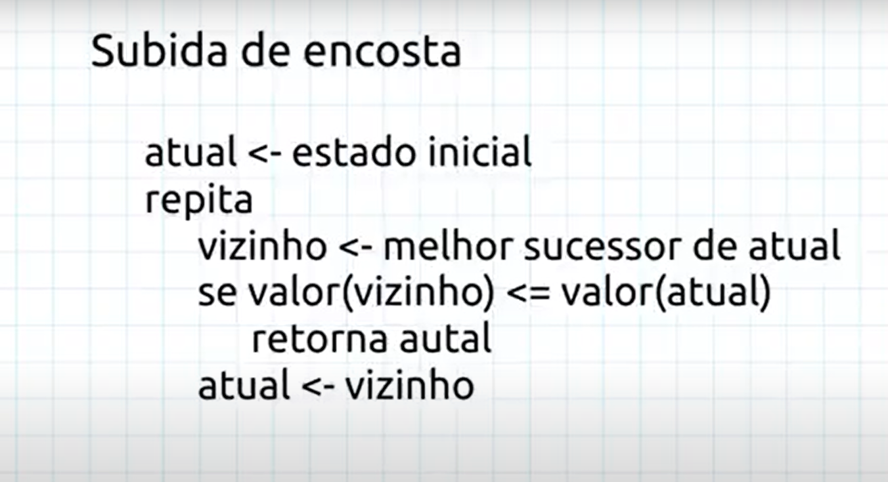
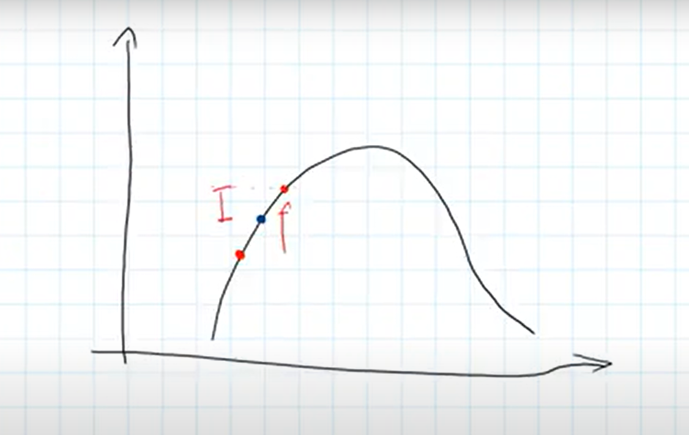

# Sistemas_Inteligentes

<h2>Problemas de otimização</h2>

 

<ul>

    -Estado ao invés de caminho; 

    -Espaço de estados muito grandes;

    -Busca cega inviável;

    -Não mantém o caminho;

    -Não toda a lista de estados explorados;

    -Mantém o estado atual;

    -Mantém uma lista de estados candidatos (estado que maximiza ou minimiza a minha função);

</ul>

 
 

### Função objetivo f:
<ul>
    <li>
    Minimização:
        Estado para o qual f é mínimo
    </li>
    <li>
    Maximização:
        Estado para o qual f é máximo
    </li>
</ul>

 
 

 

<h1>Primeiro algoritmo</h1>

<h2>--> Subida de encosta</h2>
 

 
 
 

### O funcionamento do algoritmo acontece quando o estado atual(azul) e maior ou igual que o o estado vizinho(vermelho). Dessa forma, a cada iteração ocorre essa verificação para chegar a um máximo global ou mínimo global.
 
 

 
 

## Implementar um algoritmo de otmização é algo análogo ao de um algoritmo de busca.

 
 

## Otimização
    - Estado inicial;
    - Sucessor;
    - Função objetivo.

## Busca
    - Estado inicial;
    - Expandir;
    - Heurística.

## Problemas do algoritmo
    - Preso facilmento em min/max locais;
    - Não é garantidamente ótimo.

## Solução 
    - Reinício aleatório;
    - Estabelecer um critério de parada;
    - Analisar se é ótimo.

 

 

<h1>Têpera simulada</h1>